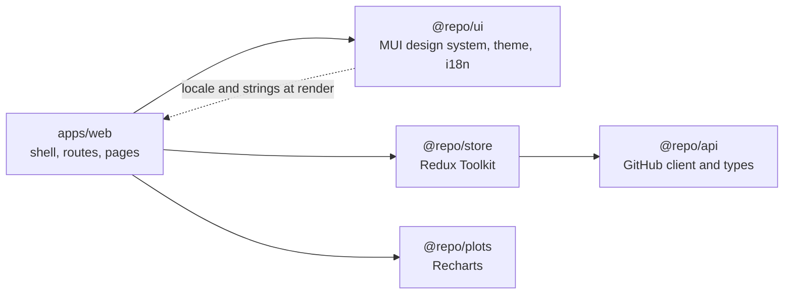
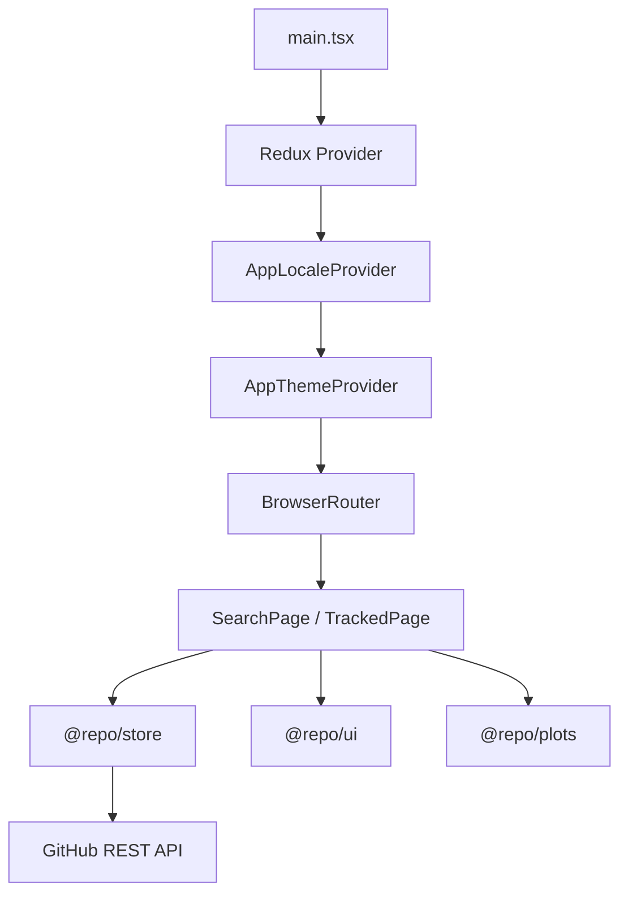
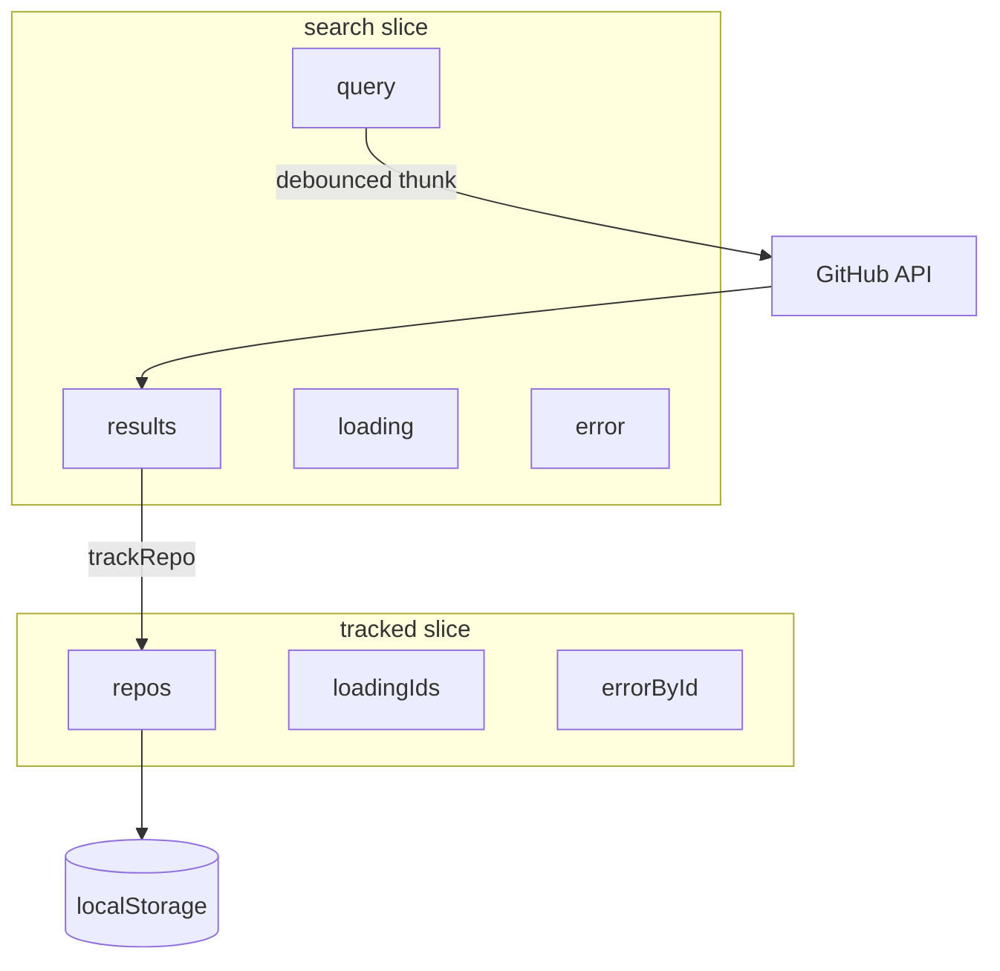

# Repo Radar

A GitHub repository search and tracking dashboard. Built as a senior frontend take-home: a thin app shell, a reusable design system, a typed API client, and feature-sliced client state.

**Extra mile — localization.** Siemens is a multinational engineering company. Product UI that ships in one language is not enough for global teams, so English and German are first-class in the design system (JSON catalogs, locale-aware dates/numbers, MUI locale). This was not required for the core task; it is included because i18n is table stakes for Siemens-scale products.

**Extra mile — accessibility.** Keyboard-only use is a requirement for inclusive products, not an afterthought. The shell is operable without a mouse: skip link, landmarks, visible focus, labeled search, live result announcements, and GitHub-style shortcuts (`/` search, `t` tracked, `?` help, `Esc` to clear or dismiss). This was not required for the core task; it is included because a11y is table stakes for Siemens-scale products.

## Core features

- **Search** — type-ahead GitHub search with 400ms debounce, empty and no-result states, and a stale-query guard so slow responses cannot overwrite a newer search
- **Track / untrack** — add a hit to the watchlist from search; remove it from the tracked view
- **Watchlist** — persisted in `localStorage`; survives refresh. Shows description, stars, open issues, language, and last commit date
- **Refresh** — per-repository refresh plus refresh-all, each with its own loading spinner and error (one failed repo does not block the others)
- **Stars chart** — bar chart comparing tracked repositories side by side
- **Design system** — shared MUI components (`RepoCard`, `SearchInput`, `EmptyState`, `ErrorAlert`, page header) and light / dark theme, persisted
- **Localization (extra mile)** — English and German JSON catalogs, language dropdown, locale-aware dates/numbers, and MUI `en` / `de`. Theme and locale sit in the design system, not in Redux
- **Accessibility (extra mile)** — skip-to-content, `header` / `nav` / `main` landmarks, visible `:focus-visible` rings, labeled search with `/` and `Esc`, live status for results, and a `?` shortcut dialog. Tab, Enter, and Space work on every control; `t` opens the watchlist when you are not typing

## Setup

Requires **Node 22+** and **pnpm 9** (`packageManager` is pinned in the root `package.json`).

```bash
pnpm install
pnpm dev
```

The Vite app listens on [http://127.0.0.1:43123](http://127.0.0.1:43123) (`strictPort: true`). If that port is already taken, stop the other process first.

```bash
pnpm build       # packages + web
pnpm typecheck
pnpm lint
```

### GitHub token (optional, recommended)

Unauthenticated GitHub REST access is **60 requests/hour**. Search plus per-repo commit lookups hit that quickly.

```bash
# apps/web/.env.local
VITE_GITHUB_TOKEN=ghp_your_token_here
```

Use a fine-scoped personal access token. Restart `pnpm dev` after adding it. For Vercel, set the same variable in the project environment.

### Deploy

`vercel.json` already points the build at the monorepo root (`pnpm turbo run build --filter=web`, output `apps/web/dist`). Import the repo in Vercel and deploy.

---

## Architecture

The app is a **pnpm + Turborepo monorepo**. `apps/web` is a composition root, not a dumping ground. Domain logic, UI, charts, and the GitHub client live in packages so they can be tested and evolved independently — the same split you want before a design system is reused across products.



### Why a thin app

`apps/web` owns routing (`/` search, `/tracked` watchlist), page-level copy, and wiring. It does not own theme tokens, GitHub mapping, or chart rendering. That keeps pages replaceable and packages reusable.

Runtime composition:



Locale wraps theme so `createAppTheme(mode, locale)` can pass MUI `enUS` / `deDE`. Domain data (search + tracked) stays in Redux. UI preferences do not.

---

## Technical decisions

### 1. Feature slices, not one `repoSlice`

Search and tracked are both “about repos,” but they are **two state machines** with different shapes, loading models, and lifetimes. They are split on purpose.

| | `search` | `tracked` |
|---|---|---|
| Job | Type, debounce, show hits | Own a watchlist |
| Data | `query` + raw `GithubRepo[]` | Normalized `TrackedRepo[]` + last commit |
| Loading / errors | One list request | Per-id `loadingIds` / `errorById` |
| Lifetime | Ephemeral; cleared with the query | Durable; preloaded and saved to `localStorage` |



They meet in one place: SearchPage reads `tracked.repos` to mark a hit as already tracked. That is a **cross-slice read**, not a reason to merge.

A single `repoSlice` would mix keystrokes with persisted favorites, stale-query guards with per-id upsert/refresh, and force persistence to filter “only the tracked part” out of a mixed blob.

A **normalized entity cache** (`entities[id]` + `search.resultIds` + `tracked.ids`) would be the right next step if many screens shared one repo object. This product has two screens and two shapes (`GithubRepo` vs `TrackedRepo`), so feature slices stay smaller.

### 2. UI preferences stay out of Redux

Theme and locale are **preferences**, not domain data. They live in `@repo/ui` as React context + `localStorage`, same pattern as each other:

- `github-repo-tracker:theme`
- `github-repo-tracker:locale`

Redux stays focused on GitHub search and the watchlist. Switching language does not go through a reducer.

### 3. Translate at render, store keys

Redux cannot call `useLocale()`. Error fallbacks in thunks are catalog keys (`errors.searchFailed`), not English sentences. Pages and `RepoCard` call `t(error)` at render. Switch `en` → `de` and already-fetched errors update. Raw GitHub messages (rate limit, `Not Found`) pass through when they are not keys.

Presentational components (`PageHeader`, `EmptyState`, `StarsBarChart`) take finished strings. `@repo/plots` has no i18n or MUI dependency.

### 4. Custom i18n in the design system (extra mile)

No `i18next`. Locale mirrors theme: `AppLocaleProvider`, `useLocale()`, JSON catalogs in `@repo/ui`, dropdown in the app bar. For two languages and ~40 strings, a small `t()` with interpolation and `_one` / `_other` plurals is enough. The catalogs are a map today so a later i18n API can replace static imports without changing callers.

English and German are the first pair because they match a Siemens-relevant locale set; dates and numbers use `en-US` / `de-DE`.

### 5. Keyboard accessibility in the shell (extra mile)

Mouse-first MUI is not enough. The app shell owns the keyboard model so every page inherits it:

| Input | Action |
|---|---|
| `Tab` / `Shift+Tab` | Move between controls (native). Skip link is first in the tab order |
| `/` | Focus search (routes to Search if you are on Tracked) |
| `t` | Open tracked repositories (ignored while typing in an input) |
| `?` | Open the shortcut dialog |
| `Esc` | Clear the search field, or close the dialog / language menu |

Search is a real labeled field (`<label>` + `type="search"`), not placeholder-only. Results announce through an `aria-live` status region so a screen reader hears “Searching…” then “10 repositories found” without moving focus. Repo names that open GitHub include “opens in a new tab” in the accessible name. The stars chart is visual; the same numbers are on the cards below, which stay fully keyboard-operable.

Visible focus uses `:focus-visible` in the theme so keyboard users get a 2px primary outline without painting a ring on every mouse click.

### 6. Debounce in the UI, stale-query guard in the store

`useDebouncedValue` (400ms) lives in the page so GitHub is not hit on every keystroke. The search thunk still drops stale responses if the query changed while a request was in flight, and skips duplicate fetches for the same trimmed query.

### 7. Charts as their own package

`@repo/plots` is Recharts-only. The tracked page injects theme colors, locale, and labels. Charts stay swappable without pulling MUI or Redux.

---

## Assumptions and limitations

- **GitHub is the only backend.** There is no app server, auth, or i18n API. Tracked repos, theme, and locale persist in `localStorage` on this browser only.
- **Token is optional.** Without `VITE_GITHUB_TOKEN`, unauthenticated rate limits apply. The UI surfaces GitHub’s own error text when that happens.
- **Search is not paginated.** The client requests a small first page (10 hits) — enough for the interaction, not a full GitHub clone.
- **GitHub payload is not translated.** Names, descriptions, and languages stay as returned. App chrome (nav, empty states, buttons, errors we own) is localized.
- **No locale-prefixed routes or RTL.** `en` and `de` are LTR. Adding Arabic/Hebrew would need direction on the theme.
- **Chart is not a keyboard widget.** Recharts bars are pointer-oriented; star counts are also on each `RepoCard`, which is fully operable with Tab / Enter.
- **No shared repo entity cache.** Search results and tracked repos are mapped at the track boundary (`mapGithubRepoToTracked`). Refresh re-fetches repo + latest commit for that id only.
- **VITE_ token is exposed to the client.** Acceptable for a personal PAT in a take-home; not how a production Siemens app would proxy GitHub.

## Package map

| Path | Name | Role |
|------|------|------|
| `apps/web` | `web` | Shell, routes, pages |
| `packages/ui` | `@repo/ui` | MUI system, theme, locale, shared components |
| `packages/store` | `@repo/store` | RTK store, thunks, watchlist persistence |
| `packages/api` | `@repo/api` | GitHub REST client, types, mappers |
| `packages/plots` | `@repo/plots` | Stars bar chart |
